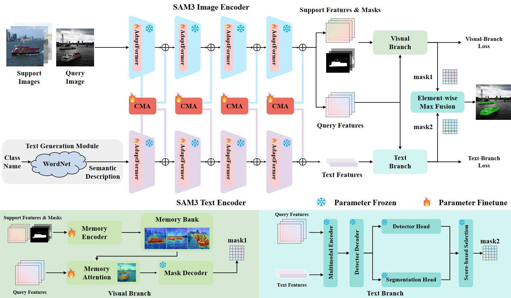

<div align="center">

# SAM3-VLFS: From Alignment to Interaction with Dual-Stage Collaboration for Few-Shot Segmentation

</div>

**SAM3-VLFS** extends the capabilities of the powerful **Segment Anything 3 (SAM3)** foundation model into a specialized few-shot segmentation framework. Through targeted parameter fine-tuning and vision-language collaboration, the model is designed to perform highly accurate segmentation tasks using a few annotated samples.



🚀 **Parameter Efficient:** Freezes the core SAM3 backbone by integrating lightweight Adaptformers into the text and vision encoders, while fully fine-tuning only the memory encoder and memory attention modules.

📈 **Vision-Language Driven:** Synergizes multimodal representations through deep cross-modal feature interaction and dual-branch decision fusion. 

🌐 **Broad Dataset Support:** Supports COCO-20 $^i$ and PASCAL-5 $^i$ with built-in data loaders.

---

## ⚙️ Environment Setup  

SAM3-VLFS requires **Python 3.12+**, **PyTorch 2.6+**, and a CUDA-compatible GPU (CUDA 12.4 recommended).

To set up the conda environment, run:

```bash
conda create -n sam3_vlfs python=3.12 -y
conda activate sam3_vlfs

# Install PyTorch with CUDA 12.4 and other dependencies
pip install -r requirements.txt

# Download standard NLTK data for Vision-Language evaluation
python -c "import nltk; nltk.download('wordnet', download_dir='./nltk_data')"
```

## 🧠 SAM3 Weights Download

According to the official SAM3 documentation, model checkpoints are provided on Hugging Face:

- [SAM3 Checkpoints (Hugging Face)](https://huggingface.co/facebook/sam3)
- [SAM3 Checkpoints (ModelScope)](https://www.modelscope.cn/models/facebook/sam3)

After requesting access and completing authentication (for example, `hf auth login`), download the SAM3 checkpoint file `sam3.pt` and place it under the `weights/` folder in this project root.

Expected layout:

```text
SAM3-VLFS/
├── weights/
│   └── sam3.pt
├── main.py
├── eval.py
└── ...
```

---

## 📊 Data Preparation
By default, the framework expects datasets to be located under `data`. You can override this using the `--data_root` flag.

The expected directory structure for COCO-20$^i$ and PASCAL-5$^i$ is:

```text
data/
├── COCO2014/           
│   ├── annotations/
│   │   ├── train2014/
│   │   └── val2014/
│   ├── train2014/
│   ├── val2014/
│   └── splits/
└── VOCdevkit2012/
    └── VOC2012/
        ├── JPEGImages/
        ├── SegmentationClassAug/
        └── fss_list/
```

### 🥥 COCO-20<sup>i</sup>
Download COCO2014 train/val images and annotations:
```bash
wget http://images.cocodataset.org/zips/train2014.zip
wget http://images.cocodataset.org/zips/val2014.zip
wget http://images.cocodataset.org/annotations/annotations_trainval2014.zip
```
Download custom train/val annotations: [train2014.zip](https://drive.google.com/file/d/1cwup51kcr4m7v9jO14ArpxKMA4O3-Uge/view?usp=sharing), [val2014.zip](https://drive.google.com/file/d/1PNw4U3T2MhzAEBWGGgceXvYU3cZ7mJL1/view?usp=sharing). <br>
Unzip and place both `train2014/` and `val2014/` under `data/COCO2014/annotations/`.

### 🔩 PASCAL-5<sup>i</sup>
Download VOC2012 train/val images and annotations: 
```bash
wget http://host.robots.ox.ac.uk/pascal/VOC/voc2012/VOCtrainval_11-May-2012.tar
```
Download PASCAL VOC2012 SDS extended mask annotations (labels): [Google Drive](https://drive.google.com/file/d/10zxG2VExoEZUeyQl_uXga2OWHjGeZaf2/view?usp=sharing).  
Place the extracted label files under `data/VOCdevkit2012/VOC2012/SegmentationClassAug/`.
Ensure you have the augmented annotations and the few-shot splits (`fss_list/`) in `data/VOCdevkit2012/VOC2012/`.

---

## 💻 Evaluation (Inference)

To evaluate a pre-trained SAM3-VLFS model on strict few-shot segmentation protocols:

```bash
python eval.py \
  --dataset_file coco \
  --fold {0|1|2|3} \
  --resume /path/to/checkpoint.pth \
  --name_exp eval_vlfs_coco \
  --shots {1|5} \
  --channel_factor 0.25 \
  --prompt mask \
  --device cuda
```

*Note: For qualitative visualizations, simply append the `--visualize` flag.*

---

## 📈️ Training
To fine-tune the SAM3-VLFS adapters on a single dataset while holding out specific folds for novel class evaluation, use `main.py`:

```bash
python main.py \
  --batch_size 4 \
  --name_exp train_coco_f0 \
  --dataset_file coco \
  --fold 0 \
  --prompt mask \
  --lr 1e-4 \
  --epochs 5 \
  --channel_factor 0.25
```
*(Passing `--fold 0` evaluates on fold 0 and trains on the remaining folds).*


### Distributed Training
To run multi-GPU training via PyTorch DDP:
```bash
torchrun --nproc_per_node=<NUM_GPUS> main.py --dataset_file coco [...]
```

## Acknowledgements
This project combines and builds upon code from the following amazing repositories:
- [SAM 3 (Segment Anything 3)](https://github.com/facebookresearch/sam3)
- [SANSA](https://github.com/ClaudiaCuttano/SANSA)
